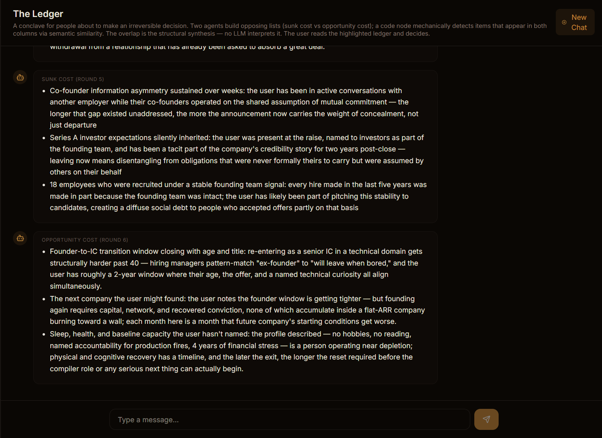

# OpenConclave

**Where one agent isn't enough.**

Run multiple AI agents together — in pipelines, debates, and teams. They work in parallel, challenge each other, ask you questions mid-run, and remember what they learned. All on your machine.

<p align="center">
  
</p>

---

## Install

```powershell
# Windows
irm https://openconclave.com/install.ps1 | iex

# macOS / Linux
curl -fsSL https://openconclave.com/install.sh | bash
```

Open [localhost:5173](http://localhost:5173) → import a starter → hit **Run**.

No runtime dependencies. Single binary. [Manual install →](#manual-install)

---

## Try something

Browse the **[conclaves repo](https://github.com/openconclave/conclaves)** for ready-to-import starters — deep code reviews, multi-agent debates, decision-support tools, and more. Drop a `.json` file into your OC instance and run it.

**To import:** Conclaves → ⬇ Import → paste URL or drop the `.json` file → map provider roles → Run.

---

## Two ways to use it

### Pipelines

Chain agents into workflows with a visual editor. Agents run in parallel, merge results, branch on conditions, loop until tests pass, and pause to ask you questions.

<p align="center">
  
</p>

```
Trigger → Agent → Output                          (simple)
Trigger → [Agent, Agent, Agent] → Merge → Agent   (parallel specialists)
Trigger → Agent → Condition → Agent ↺              (retry loop)
              ↕
         Channel Loop                               (ask Claude Code)
```

Use cases: code review, TDD pipelines, security audits, data validation, content generation with editorial review — anything where one perspective isn't enough and you want the system to learn over time.

### Discussions

Put agents in a room with a moderator. They debate, challenge each other, and build on ideas across multiple rounds. The moderator steers, summarizes, and ends with a verdict.

<p align="center">
  
</p>

Use cases: brainstorming, red-teaming, scenario planning, decision analysis, exploring a topic from multiple angles — or just entertainment.

---

## What makes this different

**Agents learn across runs.** A knowledge base stores lessons from every run. Next time, agents consult those lessons before acting. Your pipelines get smarter the more you use them.

**Multiple models in one workflow.** Use Claude for deep reasoning, GPT for a second opinion, Ollama for local-only steps — in the same pipeline. Each agent picks its own model.

**Claude-in-the-loop.** When an agent hits an ambiguous decision, it pauses the pipeline and asks Claude Code via the channel loop. Claude Code answers from context — or escalates to you in the terminal. Not a checkbox approval — an intelligent intermediary that only bothers you when it actually needs to.

**Everything stays local.** Single binary, runs on your machine, your code never leaves your laptop. No cloud. No account.

**Pipelines become tools.** Every conclave exposes as an MCP tool. Claude Code can trigger your pipelines, receive results, and answer channel loop questions.

---

## Build your own

Drag nodes, draw connections, write system prompts.

**Node types:** Trigger · Agent · Condition · Code · Merge · Channel Loop · Output · File · Discussion · Knowledge

**AI engines:** Claude · OpenAI · Ollama · any OpenAI-compatible API

**Agent tools:** Bash · Read · Write · Edit · Glob · Grep · WebSearch · WebFetch · Knowledge Search · MCP tools

**Triggers:** Manual · Cron · Webhook · Telegram · Claude Code channel

**Knowledge bases:** Embed documents with Ollama, agents get `search_knowledge` as a tool. Agents can write lessons back — your pipeline improves with every run.

**Git isolation:** Pipelines that modify code run in worktrees. Your main branch is never touched.

---

## Requirements

- **Ollama** — for local models and embeddings: `ollama pull nomic-embed-text`
- **API keys** (optional) — `ANTHROPIC_API_KEY`, `OPENAI_API_KEY`, or any OpenAI-compatible provider
- **Claude Code** (optional) — for the channel loop and conclave-as-MCP-tool integration. Two plugins: `openconclave-channel` (events, channel loop) and `openconclave-dev` (manage conclaves from Claude). See [openconclave/claude-plugin](https://github.com/openconclave/claude-plugin) for details.

> **⚠ Important — current install path:** The Claude Code plugin marketplace registration is still being finalized. Until it lands, load the plugins in dev mode every time you start Claude Code:
>
> ```bash
> claude --dangerously-load-development-channels plugin:openconclave-channel@openconclave
> claude --dangerously-load-development-channels plugin:openconclave-dev@openconclave
> ```
>
> Without these, conclave channel loops won't reach your Claude Code session and you can't manage conclaves from Claude.

## Manual install

```bash
git clone https://github.com/openconclave/oc.git
cd oc && bun install && bun start
```

## Docs

[Architecture](docs/architecture.md) · [Conclave composition](docs/conclave-composition.md) · [Security](security_guidance.md) · [Lab journal](.notes/README.md)

## Built by

OpenConclave is designed and maintained by **Ches Beiner** — a principal software engineer with 15+ years across ERP, GIS, and fintech, now building multi-agent AI systems.

- LinkedIn: [chesbeiner](https://www.linkedin.com/in/chesbeiner/)
- Contact: [beiner@me.com](mailto:beiner@me.com)

## License

MIT