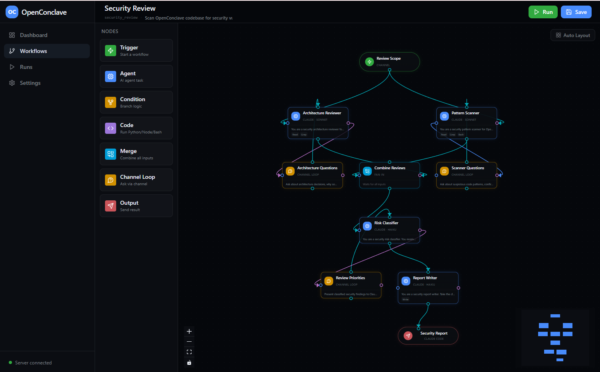

# OpenConclave

Self-hosted AI agent orchestration with visual workflow automation.



## What is it?

OpenConclave lets you wire up AI agents into visual workflows — drag nodes, draw connections, hit Run. Agents can use Claude Code, Ollama, or both in the same workflow. Everything runs on your machine.

Workflows can pause to ask you questions, send results to your terminal, trigger on a schedule, and call each other as MCP tools.

## Install

**As a Claude Code plugin** (recommended):
```bash
claude plugin install github:openconclave/openconclave
```
Server auto-starts, MCP tools auto-register, channel auto-connects. Zero config.

**Standalone:**

macOS / Linux:
```bash
curl -fsSL https://openconclave.com/install.sh | bash
```

Windows (PowerShell):
```powershell
irm https://openconclave.com/install.ps1 | iex
```

**Manual:**
```bash
git clone https://github.com/openconclave/openconclave.git
cd openconclave && bun install && bun start
```

Open http://localhost:5173

## Features

- **Visual workflow editor** — 7 node types, auto-layout, arrow markers, pill-shaped entry/exit nodes
- **Dual AI engine** — Claude Code CLI + Ollama in the same workflow. Pick the right model per task.
- **Channel-in-the-loop** — workflows pause, ask Claude Code a question, wait for your response
- **Workflows as MCP tools** — every workflow becomes a tool Claude Code can discover and call
- **Dynamic routing** — agents choose their own path via tool calls
- **Cron scheduling** — run workflows on a schedule with preset patterns
- **Telegram integration** — trigger workflows from mobile, send results to chats
- **Ollama MCP bridge** — local models use Playwright, web fetch, and other MCP tools
- **Run observability** — markdown-rendered tasks, events grouped by node, cost tracking, thinking traces
- **Crash recovery** — interrupted runs detected and marked on server restart

## Node Types

| Node | Purpose |
|------|---------|
| **Trigger** | Start a workflow (manual, cron, webhook, channel, telegram) |
| **Agent** | AI task with tool access (Claude Code or Ollama) |
| **Condition** | Branch logic with expressions |
| **Code** | Run Python, Node.js, or Bash scripts |
| **Merge** | Wait for all parallel inputs, combine into object |
| **Channel Loop** | Pause workflow, ask Claude Code, resume on response |
| **Output** | Deliver results (terminal, Telegram, log) |

## Example Workflows

**Security Review** — parallel code scanner + architecture reviewer, merge findings, classify risks, generate report

**UI Dev Team** — planner picks a task, developer implements, reviewer checks, tester validates with Playwright, committer pushes — each agent can ask Claude Code questions via channel loop

**Number Guessing Game** — two Ollama agents (Game Master + Guesser) play against each other in a loop

## Documentation

- [Architecture & API](docs/architecture.md) — tech stack, project structure, API endpoints, engine details
- [What is OpenConclave](WHAT_IS_OPENCONCLAVE.md) — detailed product definition and design philosophy
- [Security Guidance](security_guidance.md) — threat model, OpenClaw lessons, mitigation checklist
- [Plugin README](plugin/README.md) — Claude Code plugin structure and usage

## Acknowledgements

Built with [Claude Code](https://claude.ai/code) by Anthropic. Inspired by the workflow automation ideas in [n8n](https://n8n.io) and [Langflow](https://langflow.org), and the AI agent patterns emerging from the [OpenClaw](https://github.com/open-claw) community.

## License

MIT
