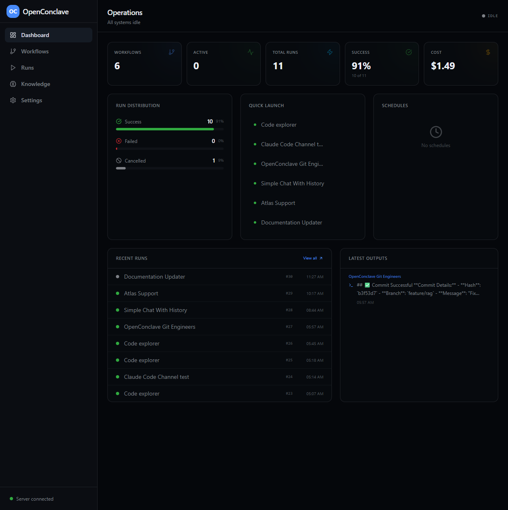
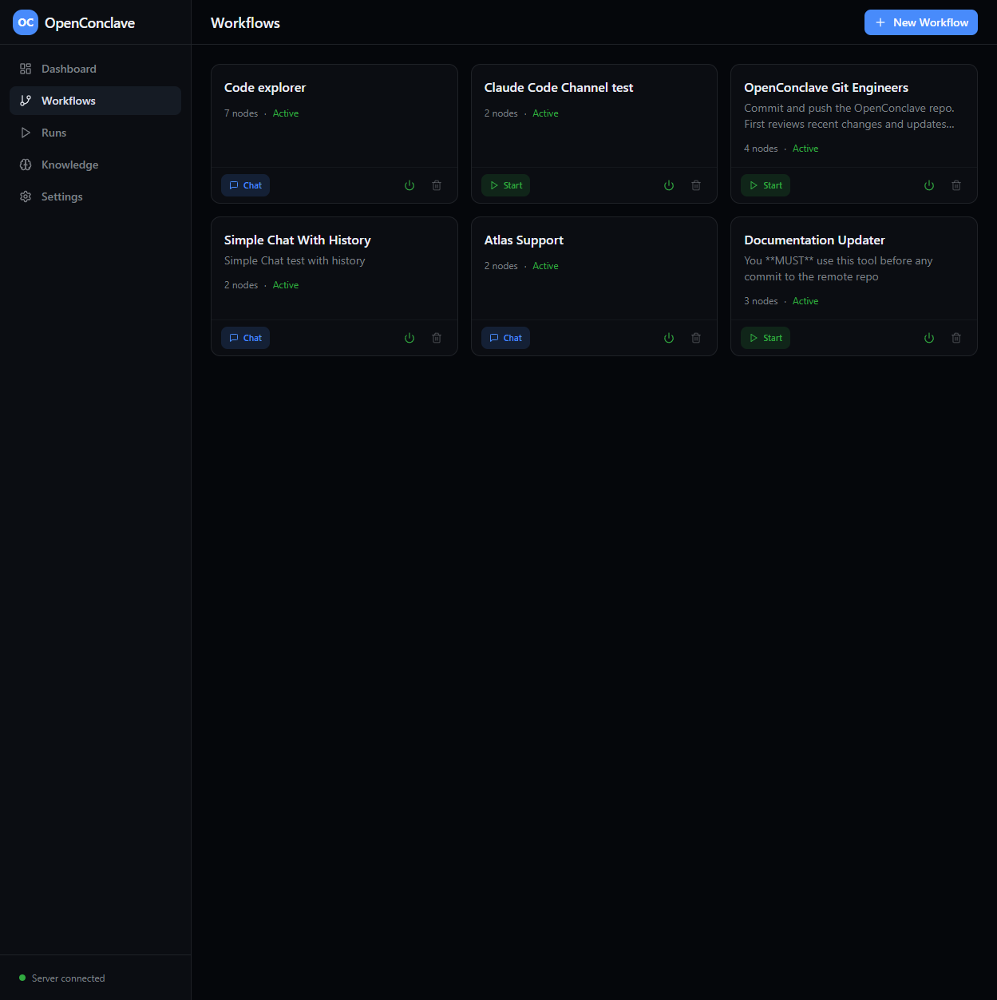
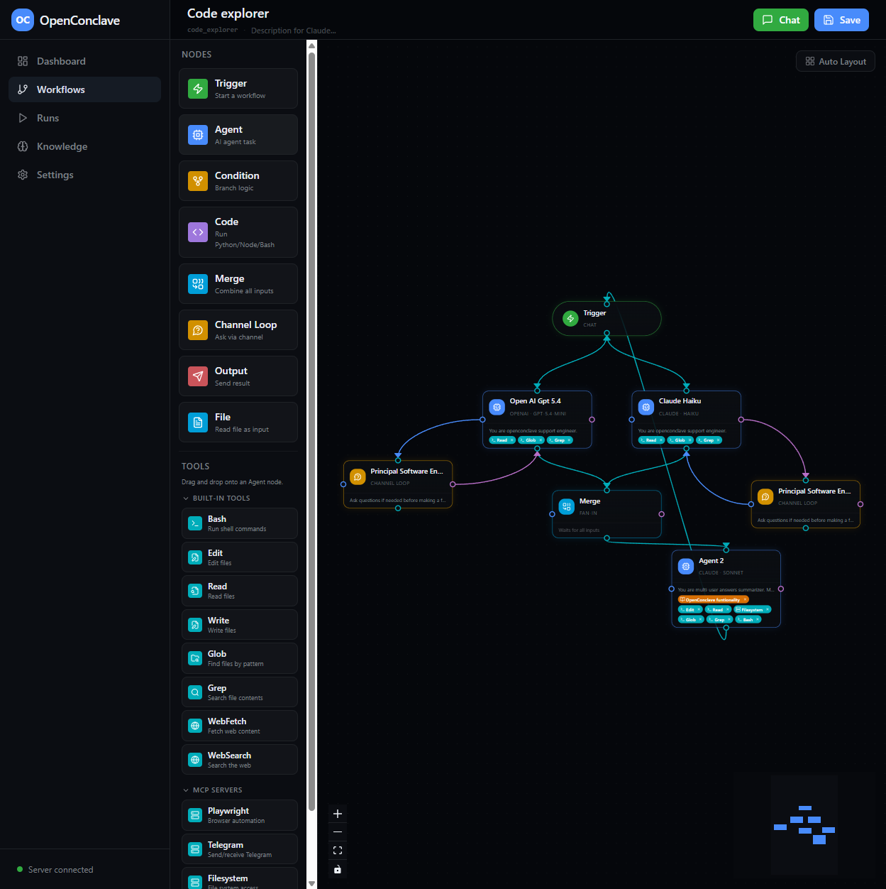
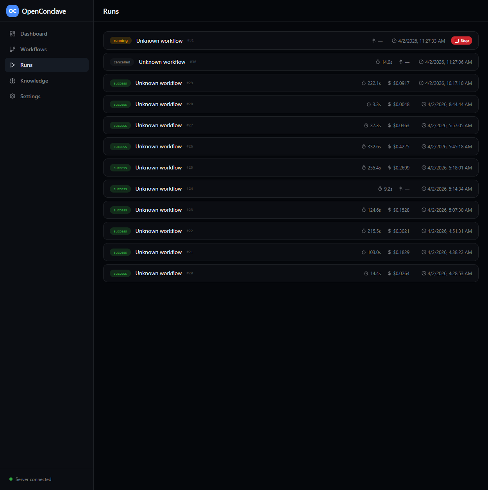
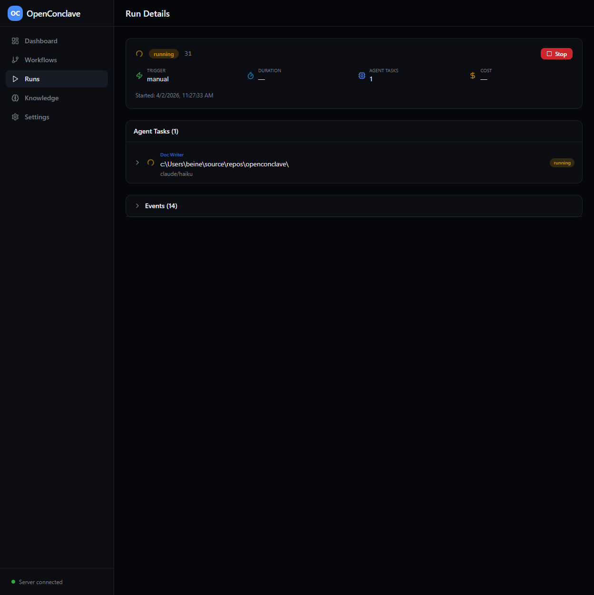
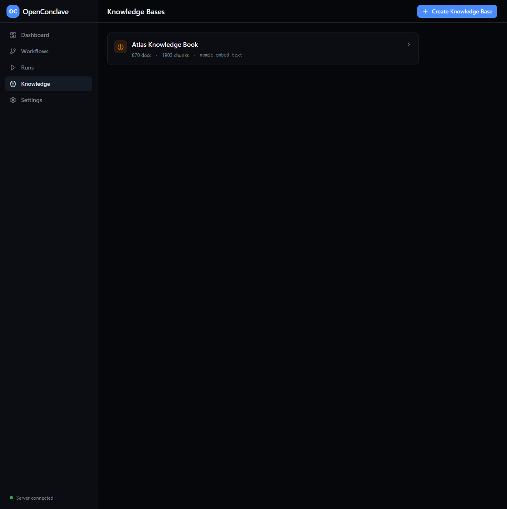
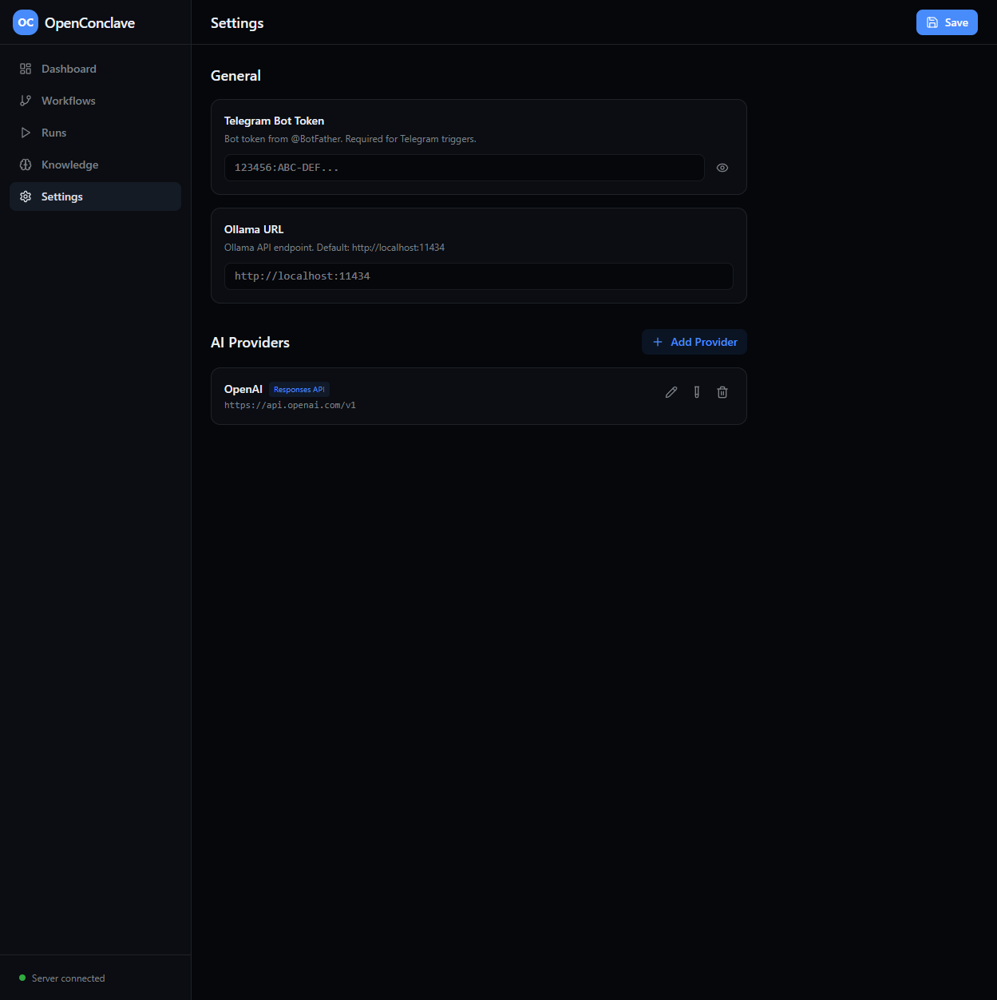
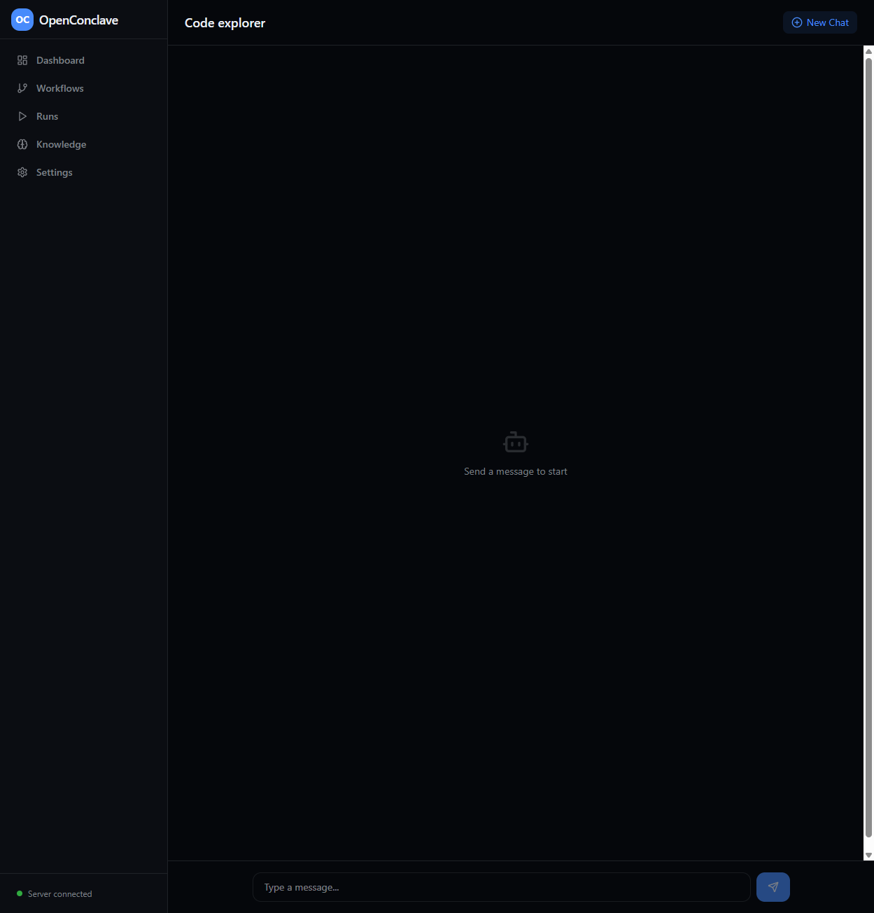

# OpenConclave Documentation

Welcome to OpenConclave documentation! This guide will help you understand, build, and deploy AI agent workflows.

## 📖 Documentation Structure

### For New Users

Start here if you're new to OpenConclave:

1. **[User Guide](./USER_GUIDE.md)** ⭐ **START HERE**
   - Quick start installation
   - Dashboard overview with screenshots
   - Creating and running workflows
   - Core concepts (triggers, agents, nodes)
   - Configuration and settings
   - FAQ

2. **[Workflow Patterns & Best Practices](./WORKFLOW_PATTERNS.md)**
   - 5 basic design patterns (sequential, parallel, conditional, loops, etc.)
   - 5 advanced patterns (channel loops, multi-agent, knowledge bases, scheduling)
   - Cost optimization strategies
   - Performance tips
   - Common pitfalls to avoid

### For Implementation

Ready to build? Check these guides:

3. **[Use Cases & Examples](./USE_CASES.md)**
   - 10 real-world examples with complete workflow designs
   - Content creation (blog posts, social media)
   - Code & development (code review, documentation)
   - Customer support (24/7 agents, email triage)
   - Data processing (pipelines, reports)
   - Business automation (lead scoring, expense approval)
   - Research & analysis (competitive intelligence)

4. **[Troubleshooting Guide](./TROUBLESHOOTING.md)**
   - Installation & startup issues
   - Workflow problems
   - Agent & AI debugging
   - Performance optimization
   - Integration troubleshooting
   - Data & storage issues

### For Technical Details

Advanced topics:

5. **[Architecture & API](./architecture.md)** (Technical)
   - System architecture
   - API endpoints
   - Engine implementation details
   - Database schema

## 🚀 Quick Navigation

### By Task

**I want to:**

- **Get started** → [User Guide Quick Start](./USER_GUIDE.md#quick-start)
- **Understand workflows** → [Core Concepts](./USER_GUIDE.md#core-concepts)
- **Create my first workflow** → [Creating Workflows](./USER_GUIDE.md#creating-workflows)
- **See what's possible** → [Use Cases & Examples](./USE_CASES.md)
- **Design better workflows** → [Workflow Patterns](./WORKFLOW_PATTERNS.md)
- **Fix a problem** → [Troubleshooting](./TROUBLESHOOTING.md)
- **Integrate with tools** → [Settings Guide](./USER_GUIDE.md#configuration)

### By Topic

**Workflows**
- [Creating workflows](./USER_GUIDE.md#creating-workflows)
- [Workflow patterns](./WORKFLOW_PATTERNS.md)
- [Example workflows](./USE_CASES.md)

**Agents & AI**
- [Agent types](./USER_GUIDE.md#agent-types)
- [Node types](./USER_GUIDE.md#node-types)
- [AI provider setup](./USER_GUIDE.md#configuration)

**Execution & Monitoring**
- [Running workflows](./USER_GUIDE.md#running-workflows)
- [Monitoring execution](./USER_GUIDE.md#monitoring-execution)
- [Troubleshooting runs](./TROUBLESHOOTING.md#workflow-issues)

**Features**
- [Knowledge bases](./USER_GUIDE.md#knowledge-bases)
- [Scheduling with cron](./WORKFLOW_PATTERNS.md#4-scheduled-batch-processing)
- [Telegram integration](./USER_GUIDE.md#configuration)
- [Multi-agent workflows](./WORKFLOW_PATTERNS.md#2-multi-agent-debate)

## 📊 Visual Guide

All documentation includes **screenshots** showing the actual UI:

1. **Dashboard** - Overview and statistics
   

2. **Workflows List** - Managing your workflows
   

3. **Visual Editor** - Drag-and-drop workflow builder
   

4. **Runs List** - Tracking execution
   

5. **Run Details** - Detailed execution logs
   

6. **Knowledge Bases** - RAG system
   

7. **Settings** - Configuration
   

8. **Chat Interface** - Conversational workflows
   

## 🎓 Learning Paths

### Path 1: Complete Beginner (2-3 hours)

1. Read [User Guide](./USER_GUIDE.md) (30 min)
2. Explore Dashboard and create simple workflow (30 min)
3. Review [Workflow Patterns](./WORKFLOW_PATTERNS.md) basic patterns (30 min)
4. Create parallel workflow example (30 min)
5. Set up knowledge base (30 min)

**Result:** Can build 2-3 node workflows

### Path 2: Intermediate User (4-5 hours)

1. Complete Beginner path
2. Study [Use Cases](./USE_CASES.md) (1 hour)
3. Implement one use case workflow (1.5 hours)
4. Learn [Advanced Patterns](./WORKFLOW_PATTERNS.md#advanced-patterns) (1 hour)
5. Set up automation (cron schedule) (30 min)

**Result:** Can build production workflows

### Path 3: Advanced (Ongoing)

1. Complete Intermediate path
2. Study [Architecture](./architecture.md) details
3. Build complex multi-agent systems
4. Integrate with external APIs
5. Optimize costs and performance

**Result:** Enterprise-grade workflows

## ⚡ Common Tasks

### Get Up and Running (5 minutes)

1. Install: [Quick Start](./USER_GUIDE.md#quick-start)
2. Open: http://localhost:5173
3. Explore: Dashboard with sample workflows
4. Run: Click "Start" on any quick launch workflow

### Create Your First Workflow (15 minutes)

1. [Click New Workflow](./USER_GUIDE.md#step-1-start-a-new-workflow)
2. [Add nodes](./USER_GUIDE.md#step-2-add-nodes) (Trigger → Agent → Output)
3. [Connect nodes](./USER_GUIDE.md#step-3-connect-nodes)
4. [Configure each node](./USER_GUIDE.md#step-4-configure-each-node)
5. [Save & Run](./USER_GUIDE.md#step-6-save-your-workflow)

### Scale to Production (1-2 days)

1. Study [Workflow Patterns](./WORKFLOW_PATTERNS.md)
2. Pick a [Use Case](./USE_CASES.md)
3. Build and test in dev
4. Set up monitoring & alerts
5. Enable cron scheduling
6. Deploy with backup strategy

## ❓ FAQ - Quick Answers

**Q: Is OpenConclave free?**
A: OpenConclave is free. You only pay for AI API calls (Claude, OpenAI, etc.) or cloud services. Ollama is free.

**Q: Can I run everything locally?**
A: Yes! Use Ollama for local models, or Claude Code if it's installed.

**Q: Where does my data go?**
A: Everything stays in `~/.openconclave/` on your machine. Nothing leaves your computer without you explicitly sending it.

**Q: Can multiple AI models work together?**
A: Yes! Mix Claude, Ollama, and OpenAI-compatible models in the same workflow.

**Q: How do I get help?**
A: Check [Troubleshooting](./TROUBLESHOOTING.md) or [FAQ](./USER_GUIDE.md#faq) in the User Guide.

**More questions?** See [Complete FAQ](./USER_GUIDE.md#faq)

## 🛠️ Troubleshooting Quick Links

- **Server won't start** → [Installation Issues](./TROUBLESHOOTING.md#installation--startup)
- **Workflow won't save** → [Workflow Issues](./TROUBLESHOOTING.md#workflow-issues)
- **Agent returns nothing** → [Agent Problems](./TROUBLESHOOTING.md#agent--ai-problems)
- **Slow execution** → [Performance Issues](./TROUBLESHOOTING.md#performance-issues)
- **Telegram not working** → [Integration Problems](./TROUBLESHOOTING.md#integration-problems)

## 📚 Additional Resources

- **GitHub Repository**: https://github.com/openconclave/openconclave
- **Project Definition**: See [WHAT_IS_OPENCONCLAVE.md](../WHAT_IS_OPENCONCLAVE.md)
- **Security Guide**: See [security_guidance.md](../security_guidance.md)
- **API Reference**: See [architecture.md](./architecture.md)

## 🎯 What You Can Do With OpenConclave

**AI Automation**
- Multi-agent systems working together
- Intelligent routing based on AI decisions
- Extended thinking and reasoning visibility

**Local Control**
- All data stays on your machine
- No external APIs required (use Ollama)
- Complete privacy and security

**Visual Design**
- Drag-and-drop workflow builder
- 9 different node types
- Real-time execution monitoring

**Integration Ready**
- MCP tools (read/write files, run commands)
- Telegram bots
- Webhook triggers
- Cron scheduling

**Cost Effective**
- Free for local models
- Only pay for API usage
- Parallel execution saves time
- Multi-model optimization

## 📝 Version Info

- **Last Updated**: April 2, 2026
- **For Version**: Latest development
- **Status**: Actively maintained

## 🚀 Next Steps

1. **New to OpenConclave?** Start with [User Guide](./USER_GUIDE.md)
2. **Want examples?** Check [Use Cases](./USE_CASES.md)
3. **Building workflows?** Learn [Patterns](./WORKFLOW_PATTERNS.md)
4. **Having issues?** See [Troubleshooting](./TROUBLESHOOTING.md)
5. **Need technical details?** Read [Architecture](./architecture.md)

---

**Happy building! 🎉**

Create intelligent workflows that bring your ideas to life.
